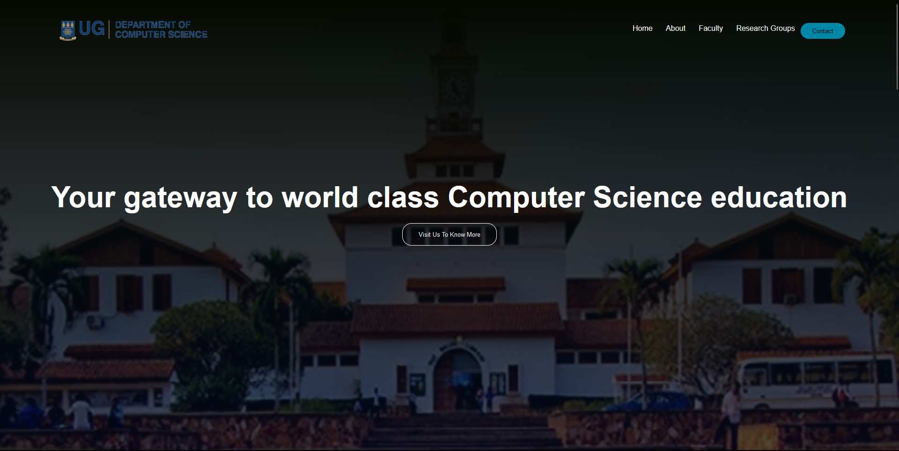

# DCIT_205_IA
# CS Department Legon Website
Introduction

Welcome to the CS Department Legon website, your gateway to world-class computer science education. This website provides information about the courses offered, faculty, research groups, and various short course programs offered by the Computer Science Department at the University of Ghana, Legon.

## Purpose of the Website

## The purpose of this website is to:

    Provide information about the Computer Science Department at the University of Ghana, Legon.
    Showcase the courses offered, including undergraduate and graduate programs.
    Highlight research groups and ongoing research activities.
    Inform about short course programs and certifications offered by the department.

## Cloning and Setup Instructions

To clone and set up this project locally, follow these instructions:

## Open a terminal and run the following command:

git clone [repository_url]

## Change into the project directory:

    cd CS_Department_Legon_Website

## Open the project in your preferred code editor.

## Explore the various HTML and CSS files to understand the project structure.

## Author Information

    Author: [Pharrell Buckman]
    Student ID: [11035620]

## Screenshots

## Homepage

.png)
.png)
.png)
.png)

## About
.png)
.png)
.png)

## Undergraduate Courses 
.png)
.png)
.png)

## Graduate Courses (MPhil)
.png)
.png)
.png)

## Graduate Courses (MSC)
.png)
.png)
.png)

## Graduate Courses (PHD)
.png)
.png)
.png)

## International Students page
.png)
.png)

## What I've Learned

Throughout this project, I have gained valuable experience in:

    HTML and CSS for web development.
    Creating a responsive and visually appealing website layout.
    Implementing navigation menus and linking multiple pages.
    Integrating external libraries and fonts.
    Implementing JavaScript for interactive features.

## Pages

    Homepage (homepage.html): Introduces visitors to the Computer Science Department and provides a brief overview.

    About Us (about.html): Details information about the department, faculty, and its mission.

    Undergraduate Courses (undergrad.html): Provides information about undergraduate programs offered by the department.

    Graduate Courses (graduate.html):  and MSc in Computer Science.

    PhD Courses (graduatephd.html): Offers information about the Ph.D. programs available in the department.

    Graduate Courses MPhil (graduate.html): Details MPhil graduate program.

    International Students Admission (internationalstu.html): Provides information about international Students.

## Additional Notes

    The website includes responsive design for optimal viewing on various devices.
    JavaScript is used for the navigation menu toggle functionality.
    External libraries, such as Font Awesome, are integrated for enhanced styling.

Feel free to explore the various sections of the website and reach out if you have any questions or feedback.

Thank you for visiting the CS Department Legon website!

## Copyright ©2023 All rights reserved.